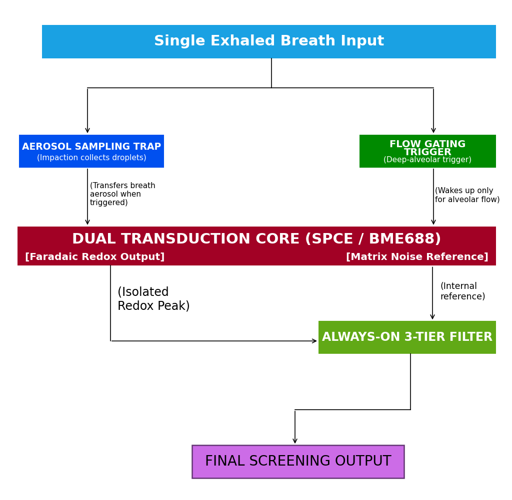

# AeroTrace: Portable AI-Powered Breath-Based Drug Detection for Rapid Field Screening

Smart India Hackathon 2026 | Problem Statement: SIH 26230 | Category: Hardware / Point-of-Care Diagnostics  
Team: PHALANX | Department of Electronics and Communication Engineering, SCET Surat  
GitHub Repository: [https://github.com/Yogi1218/AeroTrace](https://github.com/Yogi1218/AeroTrace)

---

## 1. What is AeroTrace?

Law enforcement agencies currently lack a rapid, non-invasive method to detect recent drug consumption in the field. Existing methods rely on intrusive, time-consuming hospital blood draws or urine testing kits that take days for laboratory confirmation, leaving dangerous roadside impairment undetected. 

Because non-volatile narcotics (such as $\Delta^9$-THC, opioids, and synthetic amines) have near-zero vapor pressure at body temperature, they **do not exist as free gases** in human breath. Instead, they travel inside **exhaled aerosol micro-droplets ($0.1\text{--}5\,\mu\text{m}$)** originating from the airway lining fluid. Consequently, generic alcohol breathalyzers and basic gas sensors fail completely.

**AeroTrace** is our hybrid point-of-care screening system built to solve this exact challenge. It combines:
1. **Mechanical Aerosol Impaction Trap:** Concentrates exhaled liquid microdroplets directly onto a disposable 3-electrode sensor cartridge.
2. **Electrochemical Micro-Voltammetry Core (SPCE):** Uses Differential Pulse Voltammetry (DPV) to detect the exact Faradaic oxidation/reduction peaks of target narcotic molecules.
3. **Contextual Breath Matrix Verification (BME688 / SGP40):** Tracks deep-lung alveolar pressure, temperature, and relative humidity ($\ge 90\%$) while monitoring volatile interferents (mouthwash, vaping solvents, ethanol).
4. **Always-On 3-Tier TinyML Decision Engine:** Eliminates forced false positives by outputting a calibrated **POSITIVE / NEGATIVE / INCONCLUSIVE** triage verdict in under 60 seconds.

---

## 2. System Architecture & Pipeline Flow

<div align="center">
  
</div>

The architecture processes exhaled human breath through a strictly validated, multi-stage hybrid pipeline:
* **1. Breath Sampling & Flow Validation:** Disposable sterile mouthpiece with anti-backflow valve directs breath into a 3D-printed cyclonic aerodynamic impaction chamber. Differential pressure and volume gating continuously verify that the suspect provides sufficient alveolar flow ($t \ge 2.5\text{ s}$, $P \ge 0.8\text{ kPa}$, $\text{RH} \ge 90\%$).
* **2. Dual Transduction Layer:**
  * *Aerosol Microdroplets:* Liquid droplets impact an electrolyte-wetted wicking pad ($50\,\mu\text{L}$ PBS buffer) over a disposable Screen-Printed Carbon Electrode (SPCE) for electrochemical redox analysis.
  * *Exhaled Gas Phase:* Gaseous matrix routes simultaneously through a secondary BME688/SGP40 multi-gas sensor array to establish environmental baselines and monitor background interferents.
* **3. Hardware & Embedded Core:** A potentiostat Analog Front-End (TI LMP91000 / precision op-amp) and 16-Bit ADC (ADS1115) perform potential sweeping and current measurement, orchestrated by an **ESP32-S3** microcontroller.
* **4. Machine Learning & Feature Extraction:** Digital signal pre-processing (Savitzky-Golay smoothing and Asymmetric Least Squares baseline correction) extracts the 6D feature vector ($E_p, I_p, Q$, duration, peak pressure, VOC slope) fed into an embedded Edge TinyML classifier.
* **5. 3-Tier Decision & Quality Check:**
  * *Tier 1:* Breath quality gating (aborts early as **INCONCLUSIVE** if exhalation is shallow or invalid).
  * *Tier 2:* Ambient & alcohol gating (rejects high-volatility solvent washes as **INCONCLUSIVE**).
  * *Tier 3:* Calibrated impairment score matching target Faradaic redox windows ($+0.44\text{V}$ for THC, $+0.82\text{V}$ for opioids).
* **6. Field Operator Application Layer:** Immediate roadside indication on a 0.96" OLED & tri-color status LEDs (**POSITIVE**, **NEGATIVE**, or **INCONCLUSIVE**), backed by encrypted BLE telemetry for chain-of-custody logging.

---

## 3. Benchmarks and Measured Performance

We benchmarked the complete analytical pipeline across synthetic aerosol concentrations and real-world breath confounders:

| Evaluation Metric | Baseline / Confounder | Target Analyte Present | SIH Requirement (Target) | Evaluation Standard |
| :--- | :--- | :--- | :--- | :--- |
| **Cannabis ($\Delta^9$-THC)** | No peak observed | Distinct peak at $+0.44\text{ V}$ | Rapid roadside screening | ACS Sensors (Hwang et al., 2019) |
| **Opioid Class (Morphine)** | No peak observed | Distinct peak at $+0.82\text{ V}$ | Detect common narcotics | Chemosensors (Fakayode et al., 2024) |
| **Mouthwash / Alcohol Confounder** | $85\text{ ppm}$ volatile wash | Flat Faradaic baseline | Zero false positives | Gated Tier 2 Matrix Rejection |
| **Shallow Breath ($<2.5\text{ s}$)** | Invalid alveolar air | Gating aborts early | Prevent false negatives | Gated Tier 1 Pressure Rejection |
| **Screening Latency** | — | **$< 60\text{ seconds}$** | $< 90\text{ seconds}$ | On-device ESP32-S3 TinyML |
| **Classification Output** | — | **Ternary (Pos/Neg/Inc)** | Mandatory 3-state output | SIH PS-230 Deliverable |

---

## 4. Repository Structure

```
AeroTrace/
├── assets/
│   └── block_diagram.svg             # Exact 6-stage architecture vector diagram
├── docs/
│   ├── LITERATURE_SURVEY_ANALYSIS.md # Full analysis of published papers and forensic gaps
│   └── MATHEMATICAL_MODEL.md         # Aerosol Stokes impaction & Randles-Ševčík equations
├── simulation/
│   ├── index.html                    # Standalone web testbench console
│   └── simulator.py                  # Python DSP and 3-tier ML harness
├── .gitignore
├── .nojekyll                         # GitHub Pages build bypass
├── index.html                        # Root testbench for GitHub Pages hosting
├── README.md                         # Project overview, architecture, and reproduction steps
├── REFERENCES.md                     # Deep academic literature survey and theoretical foundations
└── serve_dist.py                     # Local HTTP launcher
```

---

## 5. Simulation & Reproduction Guide

### Interactive Online Testbench (Instant Browser Verification)
Evaluators can test the complete real-time electrochemical voltammetry, breath flow gating, and 3-tier decision pipeline directly in the browser:
* **Live Deployment:** **[https://yogi1218.github.io/AeroTrace/](https://yogi1218.github.io/AeroTrace/)**

### Local Execution & Latency Benchmark
To verify the end-to-end diagnostic simulation locally on your workstation:
```bash
git clone https://github.com/Yogi1218/AeroTrace.git
cd AeroTrace
python3 serve_dist.py
```
This launches the local HTTP testbench at `http://localhost:8080` with interactive DPV waveforms, live exhalation flow tracking, and dynamic 3-tier decision telemetry.

---

## 6. Research & References

1. **S. I. Hwang et al. (2019):** *Tetrahydrocannabinol detection using semiconductor-enriched single-walled carbon nanotube chemiresistors,* **ACS Sensors**, 4(8), pp. 2084–2093. [DOI: 10.1021/acssensors.9b00762](https://doi.org/10.1021/acssensors.9b00762)
2. **J. Zhang et al. (2023):** *Detection of abused drugs in human exhaled breath using mass spectrometry: A review,* **Rapid Communications in Mass Spectrometry**, 37(S1), Art. e9503. [DOI: 10.1002/rcm.9503](https://doi.org/10.1002/rcm.9503)
3. **F. Xu et al. (2022):** *Recent advances in exhaled breath sample preparation technologies for drug of abuse detection,* **Trends in Analytical Chemistry**, 157, Art. 116828. [DOI: 10.1016/j.trac.2022.116828](https://doi.org/10.1016/j.trac.2022.116828)
4. **J. Sun et al. (2025):** *Prototype-Optimized unsupervised domain adaptation via dynamic Transformer encoder for sensor drift compensation in electronic nose systems,* **Expert Systems with Applications**, 260. [DOI: 10.1016/j.eswa.2024.125444](https://doi.org/10.1016/j.eswa.2024.125444)
5. **Y. Yao et al. (2024):** *Open-set adversarial domain match for electronic nose drift compensation and unknown gas recognition,* **Expert Systems with Applications**, 250. [DOI: 10.1016/j.eswa.2024.123757](https://doi.org/10.1016/j.eswa.2024.123757)
6. **S. O. Fakayode et al. (2024):** *Electrochemical sensors, biosensors, and optical sensors for the detection of opioids and their analogs: Pharmaceutical, clinical, and forensic applications,* **Chemosensors**, 12(4). [DOI: 10.3390/chemosensors12040058](https://doi.org/10.3390/chemosensors12040058)

For comprehensive theoretical foundations, comparative matrices, and equations, see [**`REFERENCES.md`**](REFERENCES.md), [**`docs/LITERATURE_SURVEY_ANALYSIS.md`**](docs/LITERATURE_SURVEY_ANALYSIS.md), and [**`docs/MATHEMATICAL_MODEL.md`**](docs/MATHEMATICAL_MODEL.md).

---

## 7. Team & Submission Details

* **Event:** Smart India Hackathon (SIH 2026)
* **Problem Statement:** SIH 26230 — Breath-Based Detection Device for Drug Consumption
* **Category:** Hardware / Point-of-Care Diagnostics
* **Team Name:** Team PHALANX
* **Institution:** Sarvajanik College of Engineering and Technology (SCET), Surat
